# ___VK Client___
>## ___*Дипломный проект по курсу iOS разработки*___
>### _Клиент для социальной сети ВКонтакте_
---
***
>### ___`Архитектура MVVM`___
***
- ### В качестве экрана входа используется библиотека **_VK ID_**
- ### Сетевой слой создан при помощи *URLSession*
- ### Все функции используют подход *Swift Concurrency*
- ### В качестве интерфейсной платформы используется ___SwiftUI___
***
***
>## **_Иконка_**
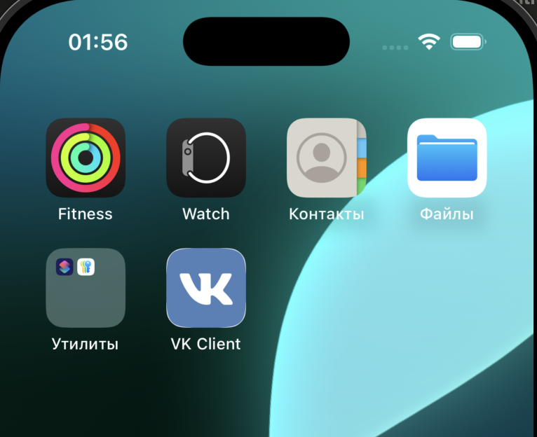

>## **_Экраны авторизации_**
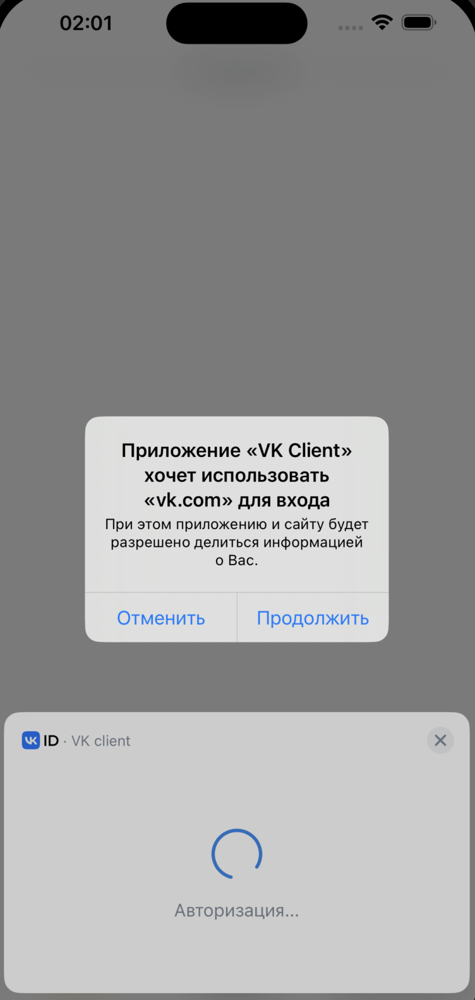
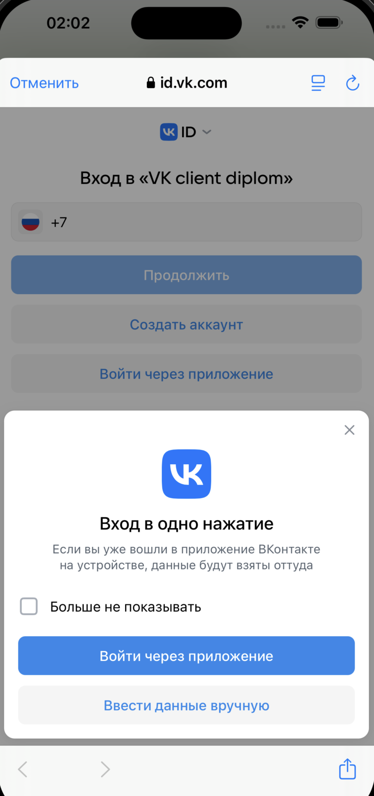
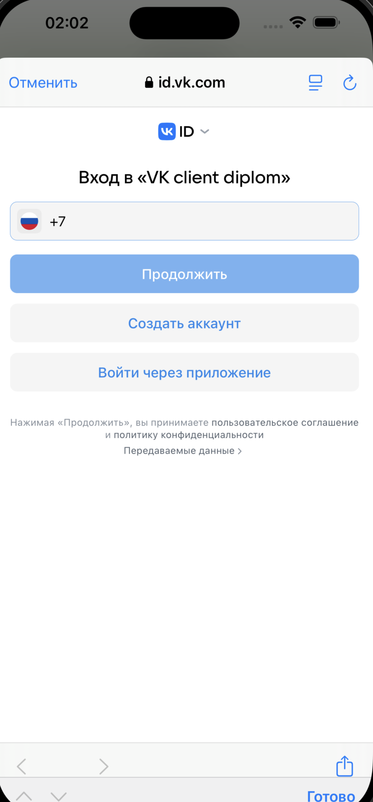
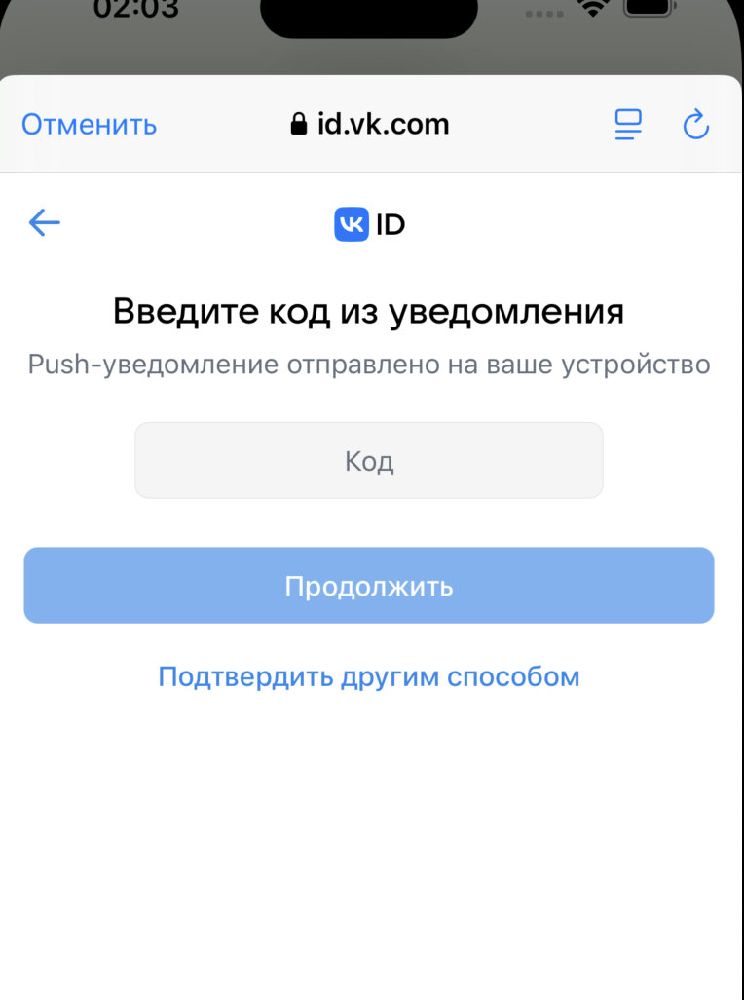
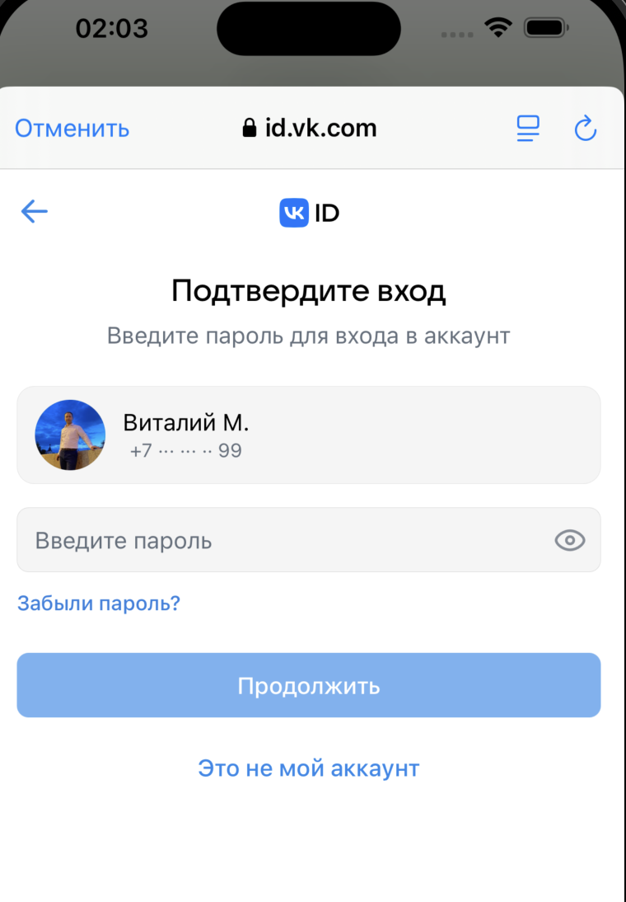

>## **_Лента_**
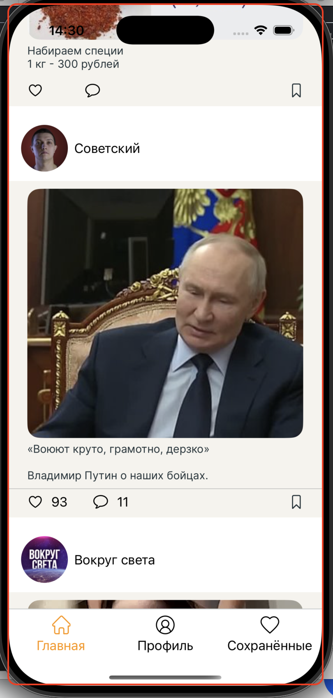

>## **_Истории друзей_**
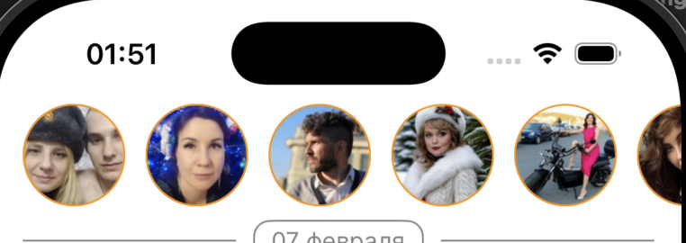

>## **_Виджет Друзья/Подписчики_**
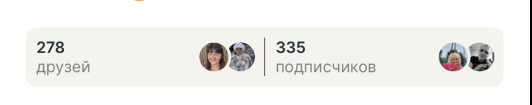

>## **_Подробная информация_**
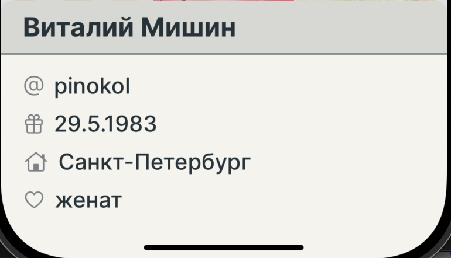

>## **_Сохранённые посты_**
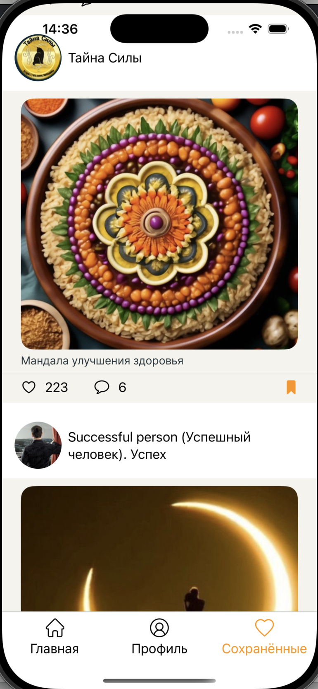

>## **_Профиль пользователя_**
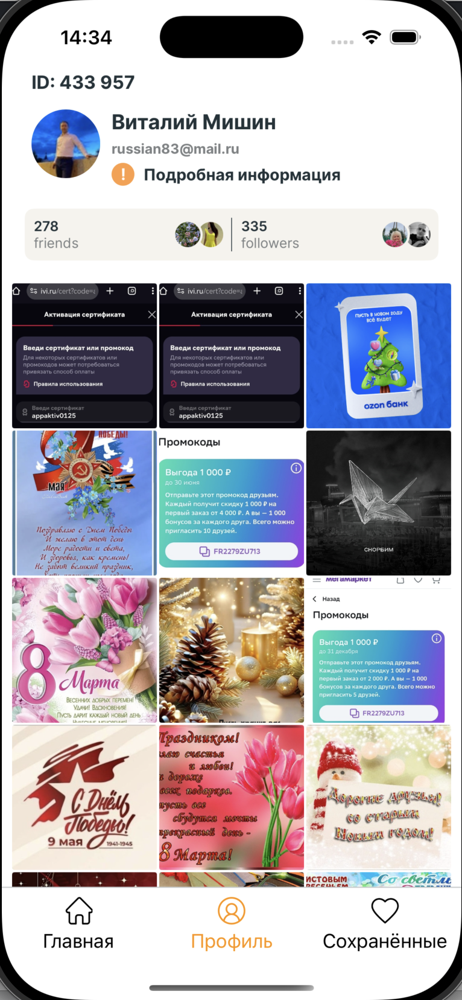